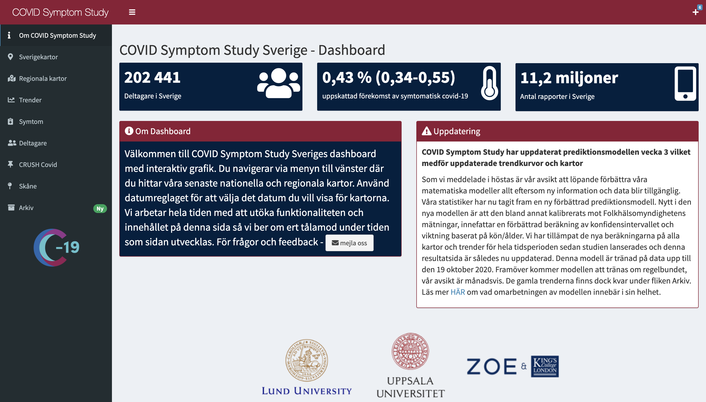

# COVID Symptom Study Sweden (CSSS) - open datasets

Here you will find CSSS open datasets.

## End of data collection

On 11 July 2022, we have completed the data collection phase of CSSS. We
would like to thank our participants for their contribution to the
research and our study since the start of the covid-19 pandemic. Without
their data, it would not have been possible for us to follow the spread
of infection in Sweden. We will continue to publish our results in
scientific articles and at scientific meetings and we will share these
results on the study’s website as soon as they have been reviewed and
published. You can read more about the end of data collection a href =
<https://www.covid19app.lu.se/artikel/vi-avslutar-var-datainsamling-0>\>
here</a> (Swedish).

## covidsymptom R package

An R package with these datasets was released in early 2021, you can
read more about it
[here](https://github.com/csss-resultat/covidsymptom).

## Dashboard

A supporting dashboard is available
[here](https://csss-resultat.shinyapps.io/csss_dashboard/).

## About COVID Symptom Study - Sweden

The COVID Symptom Study is a non-commercial project that uses a free
smartphone app to facilitate real-time data collection of symptoms,
exposures, and risk factors related to COVID-19. The app was developed
by researchers at King’s College and Guys and St Thomas’ Hospitals in
London in partnership with health science company Zoe Global
Ltd. Baseline data and recurring daily questions are described in
<a href = https://science.sciencemag.org/content/368/6497/1362> Drew et
al (Science, 2020)</a>. The app was launched in the UK and US March
2020. In Sweden, the study is based at Lund University and, as per a
collaboration agreement on 28 July 2020, Uppsala University. The app was
launched in Sweden on April 29, 2020 as part of a national research
initiative on COVID-19. To date, \>4.5 million participants in the three
countries are using the app, \~280,000 of whom live in Sweden.
Participants have so far made \~500 million data entries, with Swedish
participants contributing \~21 million of these.

The COVID Symptom Study Sweden was described on
<a href = https://www.nature.com/articles/s41467-022-29608-7> Kennedy &
Fitipaldi et al (Nature Communications, 2022)</a> publication.
